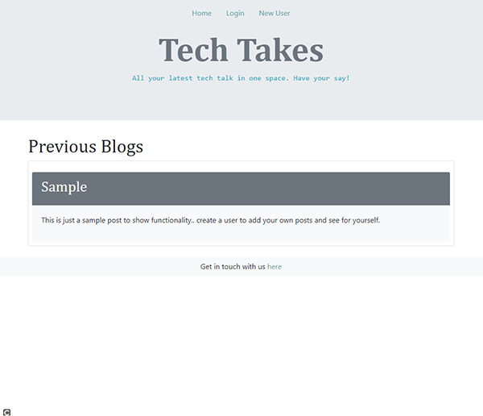

  
  # Tech Takes
  
  ## Table of Contents
  * [Description](#description)
  * [Technologies](#technologies)
  * [Installation](#installation)
  * [Usage](#usage)
  * [Contributing](#contributing)
  * [Guidelines](#guidelines)
  * [Tests](#tests)
  * [License](#license)
  * [Questions](#questions)
---

  ## Description
  Tech Takes is a CMS style blog created using the tech world as inspiration, but easily modified to fit any content. Full functionality to view, create and edit blog posts and comment on others contributions. Created using express-handlebars it offers a pleasing and easy to understand user interface, with user authentication and verification.
  
  

  ## Technologies
  * HTML
  * handlebars.js
  * CSS
  * Bootstrap
  * JavaScript
  * node.js
  * MySQL
  
  ## Installation
   No installation requirements

  ## Usage
   Visit http://tech-takes.herokuapp.com

  ## Contributing
   If you'd like to contribute, reach out through the email below

  ## Guidelines
   Create a username to login and contribute

  ## Tests
   Tests run in development

  ## License
   Licensed under [MIT](https://opensource.org/licenses/MIT) 

   ---

  ## Questions
   For any questions you can find me at [GitHub](https://github.com/mleftwich) or email me at [mleftwich@live.com](mailto:mleftwich@live.com) 
